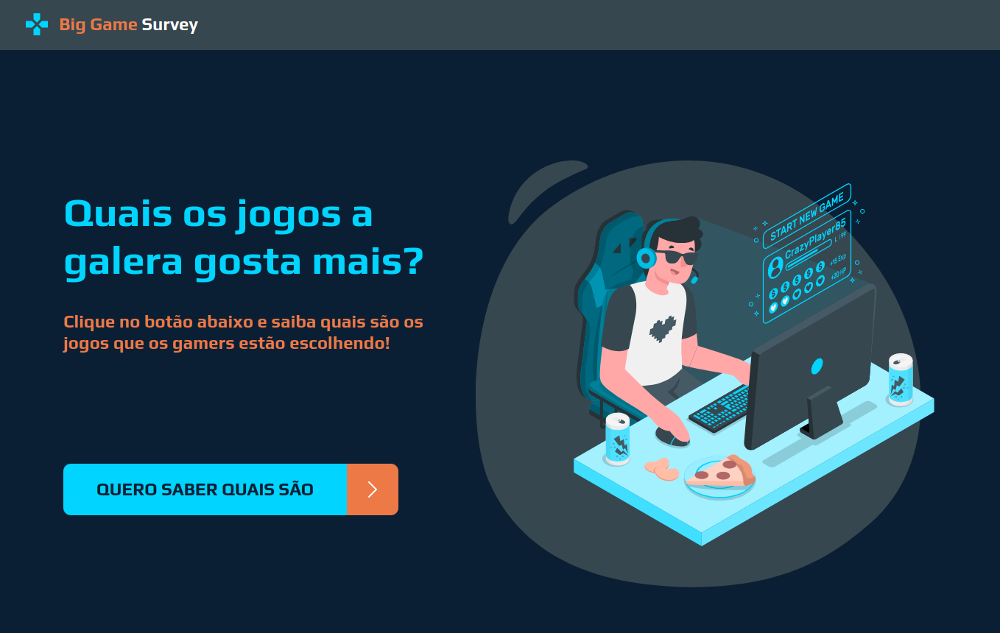
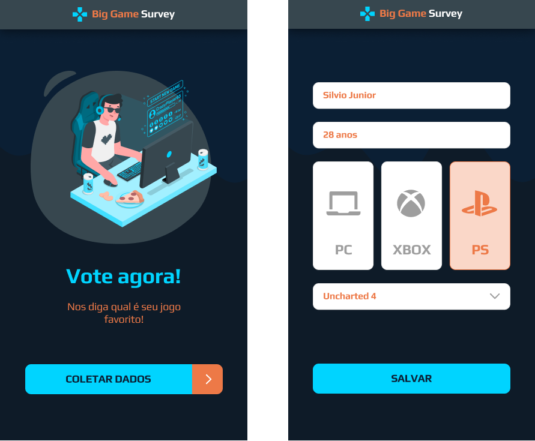

# Aplicação Big Game Survey

Projeto criado durante o evento online chamado **Semana DevSuperior 1.0** (SDS). Evento conduzido pelos instrutores do [Canal DevSuperior](https://www.youtube.com/channel/UC3twHmWQwtqEO7u-gB_2f7g), que ocorreu entre 14/09/2020 e 20/09/2020.

Projeto consiste em uma aplicação (web e mobile) de pesquisa de preferência de jogos.
Os dados da pesquisa são coletados no App Mobile e mostrados na aplicação Web.

O back-end foi feito utilizando **Java com Spring Boot**, o front web com **React** e a parte mobile com **React Native**.

Tela inicial da aplicação Web:

Telas do app mobile:

